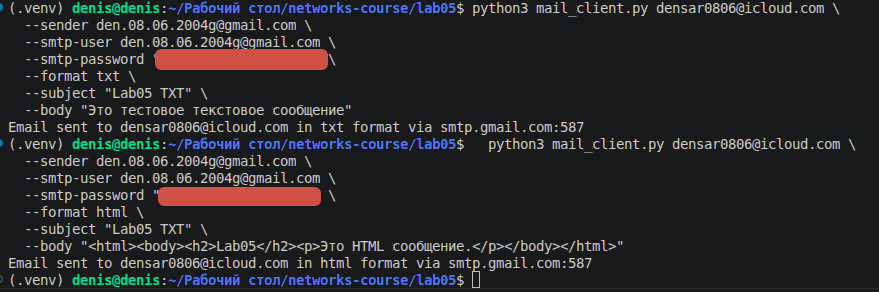
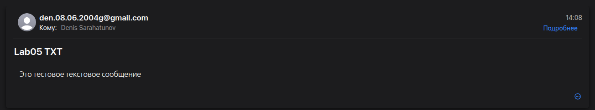
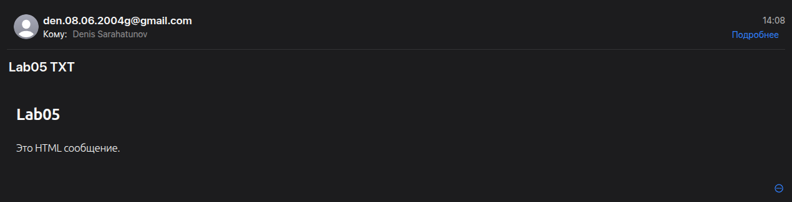
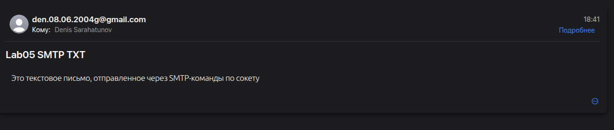
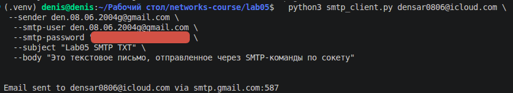
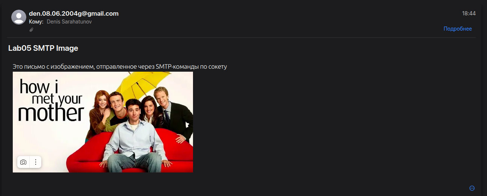
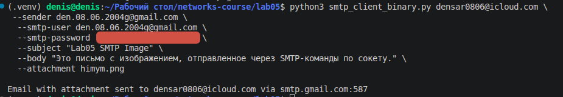
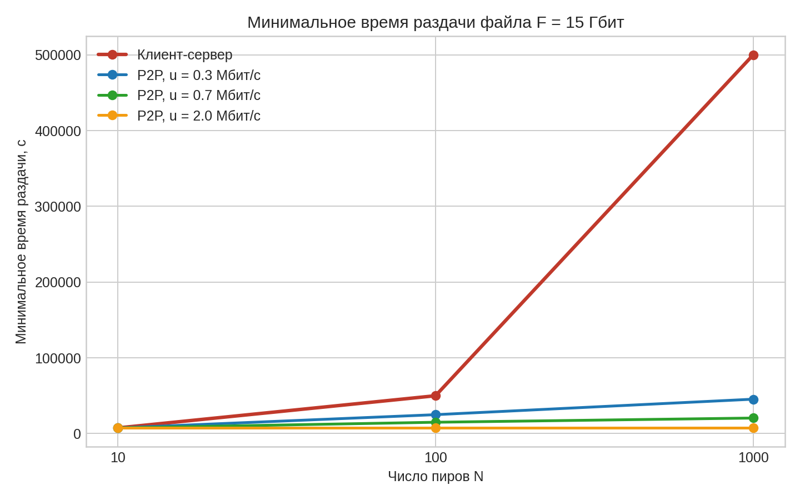

# Практика 5. Прикладной уровень

## Программирование сокетов.

### A. Почта и SMTP (7 баллов)

### 1. Почтовый клиент (2 балла)
Напишите программу для отправки электронной почты получателю, адрес
которого задается параметром. Адрес отправителя может быть постоянным. Программа
должна поддерживать два формата сообщений: **txt** и **html**. Используйте готовые
библиотеки для работы с почтой, т.е. в этом задании **не** предполагается общение с smtp
сервером через сокеты напрямую.

Приложите скриншоты полученных сообщений (для обоих форматов).

#### Демонстрация работы

### 2. SMTP-клиент (3 балла)
Разработайте простой почтовый клиент, который отправляет текстовые сообщения
электронной почты произвольному получателю. Программа должна соединиться с
почтовым сервером, используя протокол SMTP, и передать ему сообщение.
Не используйте встроенные методы для отправки почты, которые есть в большинстве
современных платформ. Вместо этого реализуйте свое решение на сокетах с передачей
сообщений почтовому серверу.

Сделайте скриншоты полученных сообщений.

#### Демонстрация работы

### 3. SMTP-клиент: бинарные данные (2 балла)
Модифицируйте ваш SMTP-клиент из предыдущего задания так, чтобы теперь он мог
отправлять письма с изображениями (бинарными данными).

Сделайте скриншот, подтверждающий получение почтового сообщения с картинкой.

#### Демонстрация работы

---

_Многие почтовые серверы используют ssl, что может вызвать трудности при работе с ними из
ваших приложений. Можете использовать для тестов smtp сервер СПбГУ: mail.spbu.ru, 25_

### Б. Удаленный запуск команд (3 балла)
Напишите программу для запуска команд (или приложений) на удаленном хосте с помощью TCP сокетов.

Например, вы можете с клиента дать команду серверу запустить приложение Калькулятор или
Paint (на стороне сервера). Или запустить консольное приложение/утилиту с указанными
параметрами. Однако запущенное приложение **должно** выводить какую-либо информацию на
консоль или передавать свой статус после запуска, который должен быть отправлен обратно
клиенту. Продемонстрируйте работу вашей программы, приложив скриншот.

Например, удаленно запускается команда `ping yandex.ru`. Результат этой команды (запущенной на
сервере) отправляется обратно клиенту.

#### Демонстрация работы
Это не сделано

### В. Широковещательная рассылка через UDP (2 балла)
Реализуйте сервер (веб-службу) и клиента с использованием интерфейса Socket API, которая:
- работает по протоколу UDP
- каждую секунду рассылает широковещательно всем клиентам свое текущее время
- клиент службы выводит на консоль сообщаемое ему время

#### Демонстрация работы
Это не сделано

## Задачи

### Задача 1 (2 балла)
Рассмотрим короткую, $10$-метровую линию связи, по которой отправитель может передавать
данные со скоростью $150$ бит/с в обоих направлениях. Предположим, что пакеты, содержащие
данные, имеют размер $100000$ бит, а пакеты, содержащие только управляющую информацию
(например, флаг подтверждения или информацию рукопожатия) – $200$ бит. Предположим, что у
нас $10$ параллельных соединений, и каждому предоставлено $1/10$ полосы пропускания канала
связи. Также допустим, что используется протокол HTTP, и предположим, что каждый
загруженный объект имеет размер $100$ Кбит, и что исходный объект содержит $10$ ссылок на другие
объекты того же отправителя. Будем считать, что скорость распространения сигнала равна
скорости света ($300 \cdot 10^6$ м/с).
1. Вычислите общее время, необходимое для получения всех объектов при параллельных
непостоянных HTTP-соединениях
2. Вычислите общее время для постоянных HTTP-соединений. Ожидается ли существенное
преимущество по сравнению со случаем непостоянного соединения?

#### Решение
Задержка распространения $= t_{prop} = \frac{10}{300 * 10^6} = 3.33 * 10^{-8} \text{ c}$ - пренебрежимо мала по сравнению со временем передачи

Размер управляющего пакета $= L_c = 200$ бит

Размер объекта $= L_o = 100000$ бит

установление TCP: 2 управляющих пакета

HTTP-запрос: 1 управляющий пакет

передача объекта: 100000 бит 

то есть $3L_c + L_o$ бит на одно непостоянное соединение

Базовый объект передаётся по одному соединению со всей скоростью канала 

$T_{base} = \frac{3 * 200 + 100000}{150} = 670.67 \text{ c}$

После этого нужно получить ещё $10$ объектов.

1. 10 встроенных объектов загружаются по 10 параллельным непостоянным соединениям, каждое получает по 15 бит/с

$T_{par} = \frac{3 * 200 + 100000}{15} = 6706.67 \text{ c}$

Тогда полное время $= T_{1} = T_{base} + T_{par} = 670.67 + 6706.67 = 7377.33 \text{ c}$

2. TCP-соединение устанавливается один раз, а затем по нему последовательно запрашиваются все объекты
   Для 11 объектов суммарно передаётся
   - одно рукопожатие: $2L_c$
   - 11 запросов `GET`: $11L_c$
   - 11 объектов данных: $11L_o$

$T_{2} = \frac{2 * 200 + 11 * 200 + 11 * 100000}{150} = 7350.67 \text{ c}$

Разница $= 7377.33 - 7350.67 = 26.67 \text{ c}$

Существенного преимущества у постоянного соединения
здесь нет: почти всё время уходит на передачу самих $11$ объектов через очень медленный канал

### Задача 2 (3 балла)
Рассмотрим раздачу файла размером $F = 15$ Гбит $N$ пирам. Сервер имеет скорость отдачи $u_s = 30$
Мбит/с, а каждый узел имеет скорость загрузки $d_i = 2$ Мбит/с и скорость отдачи $u$. Для $N = 10$, $100$
и $1000$ и для $u = 300$ Кбит/с, $700$ Кбит/с и $2$ Мбит/с подготовьте график минимального времени
раздачи для всех сочетаний $N$ и $u$ для вариантов клиент-серверной и одноранговой раздачи.

#### Решение

$D_{CS} = \max \left( \frac{NF}{u_s}, \frac{F}{d_{min}} \right)$

$D_{P2P} = \max \left( \frac{F}{u_s}, \frac{F}{d_{min}}, \frac{NF}{u_s + Nu} \right)$

$F = 15000 \text{ Мбит}, u_s = 30 \text{ Мбит/с}, d_{min} = 2 \text{ Мбит/с}$

$\frac{F}{u_s} = \frac{15000}{30} = 500 \text{ c}$

$\frac{F}{d_{min}} = \frac{15000}{2} = 7500 \text{ c}$

Для клиент-серверной схемы:

$D_{CS}(10) = \max(5000, 7500) = 7500 \text{ c}$

$D_{CS}(100) = \max(50000, 7500) = 50000 \text{ c}$

$D_{CS}(1000) = \max(500000, 7500) = 500000 \text{ c}$

Для P2P получаем:

| $u$ | $N = 10$ | $N = 100$ | $N = 1000$ |
|---|---:|---:|---:|
| $0.3$ Мбит/с | $7500$ c | $25000$ c | $45454.55$ c |
| $0.7$ Мбит/с | $7500$ c | $15000$ c | $20547.95$ c |
| $2$ Мбит/с | $7500$ c | $7500$ c | $7500$ c |

### Задача 3 (3 балла)
Рассмотрим клиент-серверную раздачу файла размером $F$ бит $N$ пирам, при которой сервер
способен отдавать одновременно данные множеству пиров – каждому с различной скоростью,
но общая скорость отдачи при этом не превышает значения $u_s$. Схема раздачи непрерывная.
1. Предположим, что $\dfrac{u_s}{N} \le d_{min}$.
   При какой схеме общее время раздачи будет составлять $\dfrac{N F}{u_s}$?
2. Предположим, что $\dfrac{u_s}{N} \ge d_{min}$. 
   При какой схеме общее время раздачи будет составлять  $\dfrac{F}{d_{min}}$?
3. Докажите, что минимальное время раздачи описывается формулой $\max\left(\dfrac{N F}{u_s}, \dfrac{F}{d_{min}}\right)$?

#### Решение
1. Если $\frac{u_s}{N} \le d_{min}$, то сервер может всё время отдавать каждому пиру одинаковую скорость $r_i = \frac{u_s}{N}$ ( $\sum_{i=1}^{N} r_i = N * \frac{u_s}{N} = u_s$)

   Для каждого пира $r_i = \frac{u_s}{N} \le d_{min} \le d_i$

   Тогда каждый пир получает файл за время $\frac{F}{r_i} = \frac{F}{u_s/N} = \frac{NF}{u_s}$.

2. Если $\frac{u_s}{N} \ge d_{min}$, то сервер может отдавать каждому пиру постоянную скорость $r_i = d_{min}$ ($\sum_{i=1}^{N} r_i = N d_{min} \le u_s$)

   $d_{min} \le d_i$ для любого пира $\Rightarrow$ самый медленный пир получает файл за $\frac{F}{d_{min}}$, и все остальные успевают не позже него. Значит общее время раздачи $\frac{F}{d_{min}}$.

3. $D \ge \frac{NF}{u_s}$, потому что сервер должен суммарно передать $NF$ бит, а его суммарная скорость не больше $u_s$

   $D \ge \frac{F}{d_{min}}$, потому что самый медленный пир физически не может принять файл быстрее, чем за $\frac{F}{d_{min}}$
